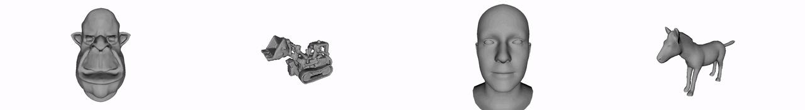

## MotionDreamer: Exploring Semantic Video Diffusion features for Zero-Shot 3D Mesh Animation




### 3DV 2025

#### [🌐 Project Page](https://lukas.uzolas.com/MotionDreamer/) | [📝 Paper](https://arxiv.org/abs/2405.20155) 

**[Lukas Uzolas](https://lukas.uzolas.com/), 
[Elmar Eisemann](https://graphics.tudelft.nl/~eisemann/),
[Petr Kellnhofer](https://kellnhofer.xyz/)**
<br>
[Delft University of Technology](https://graphics.tudelft.nl/)
<br>

Animation techniques bring digital 3D worlds and characters to life. However, manual animation is tedious and automated techniques are often specialized to narrow shape classes. In our work, we propose a technique for automatic re-animation of arbitrary 3D shapes based on a motion prior extracted from a video diffusion model. Unlike existing 4D generation methods, we focus solely on the motion, and we leverage an explicit mesh-based representation compatible with existing computer-graphics pipelines. Furthermore, our utilization of diffusion features enhances accuracy of our motion fitting. We analyze efficacy of these features for animation fitting and we experimentally validate our approach for two different diffusion models and four animation models. Finally, we demonstrate that our time-efficient zero-shot method achieves a superior performance re-animating a diverse set of 3D shapes when compared to existing techniques in a user study.


_Code coming soon._


### Citation

```
@misc{uzolas2024motiondreamerexploringsemanticvideo,
      title={MotionDreamer: Exploring Semantic Video Diffusion features for Zero-Shot 3D Mesh Animation}, 
      author={Lukas Uzolas and Elmar Eisemann and Petr Kellnhofer},
      year={2024},
      eprint={2405.20155},
      archivePrefix={arXiv},
      primaryClass={cs.CV},
      url={https://arxiv.org/abs/2405.20155}, 
}
```
